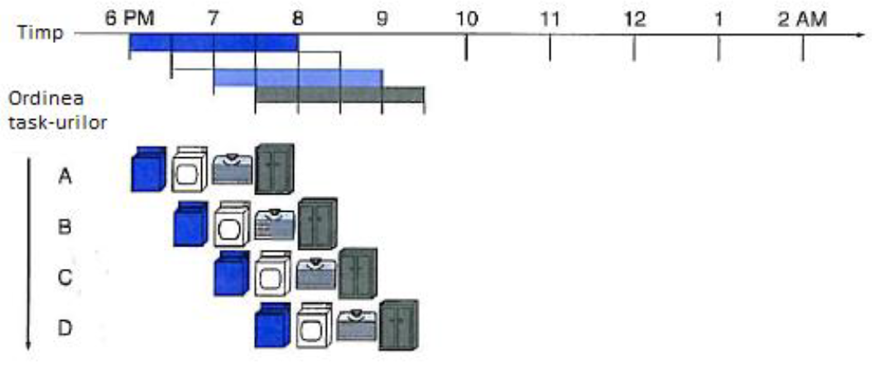

# Laboratorul 10 - pipeline, RankSort

## `MPI_Barrier(MPI_Comm communicator)`
- reprezinta bariera in MPI (remember bariera de la pthreads + Java threads)
- cum se foloseste: `MPI_Barrier(MPI_COMM_WORLD)`
